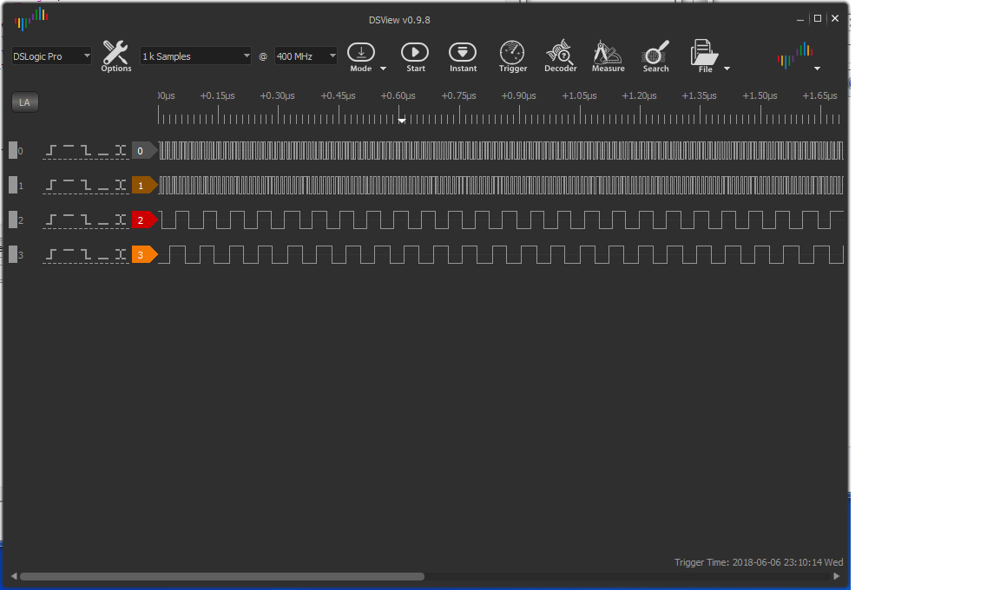

# FPGA-multi-clock-generator-XC6SLX9

Board : Xilinx X-SP6-X9 mini board (as shown in the picture)
Resources for the mini board
- http://bravelearn.com/tag/x-sp6-x9/
- https://artofcircuits.com/product/spartan-6-fpga-development-board-xc6slx9-tqg144

Using FPGA, multiple high frequency clock signals can be generated.
Xilinx Spartan-6 XC6SLX9-TQG144 speed grade 2 is used for this purpose.
Since FPGA does not have a fixed hardware structure, it can provide
very wide parallel processing. In this example, I simultaneously generated
8 different clock frequencies but it can be easily expanded to 100 different
clock frequencies. FPGA is also beneficial to clock generation because 
FPGA instructions are hardware operations executed at fixed cycles. 
Thus, clock jitter can be minimized.

Spartan-6 core has a PLL which can generate a very high frequency clocks 
(825 Mhz) as a source clock using a primary clock (50MHz).
The following 6 clocks are generated using the Digital Clocking Wizard.
The xc6slx9 is stable up to 275MHz. These clocks are used to generate
additional clocks using counters.
In this example, Clk_Out(6)(13.75MHz) is generated by dividing CLK_OUT1
(275MHz) by 20. Clk_Out(7)(14.7321 MHz) is generated by dividing CLK_OUT5
(117.857 MHz) by 8. Clk_Out(7) (14.7321MHz) can be used for a clock source
(14.7456 MHz) for RS232C.

| |Output Clock|Output Freq (MHz)|Phase Duty Cycle (%)|Pk-to-Pk Jitter (ps)|Phase Error (ps)|
|-|-|-|-|-|-|
|CLK_OUT1|275.000|0.000|50.0|203.096|221.936|
|CLK_OUT2|206.250|0.000|50.0|212.097|221.936|
|CLK_OUT3|165.000|0.000|50.0|219.401|221.936|
|CLK_OUT4|137.500|0.000|50.0|226.445|221.936|
|CLK_OUT5|117.857|0.000|50.0|234.235|221.936|
|CLK_OUT6|103.125|0.000|50.0|241.539|221.936|

> ------------------------------------------------------------------------------
> -- "Input Clock   Freq (MHz)    Input Jitter (UI)"
> ------------------------------------------------------------------------------
> -- __primary|____50.000||0.010
> -- 
> -- If you install another oscillator on the board (P127), you can
> -- generate a different set of clocks. 

Input Clock Freq (MHz)    Input Jitter (UI)

primary 50.000 0.010

If you install another oscillator on the board (P127), you can
generate a different set of clocks. 

## License
JavaTitrationApplet is licensed under <B>the MIT License</B> - see the `LICENSE` file for details.

